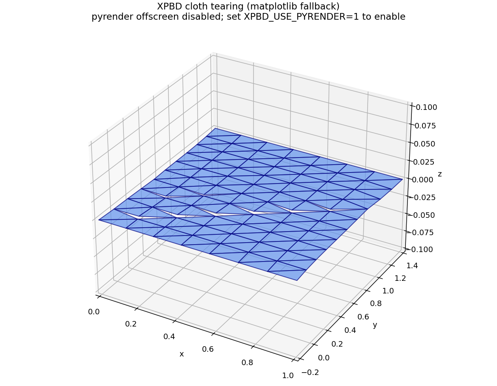
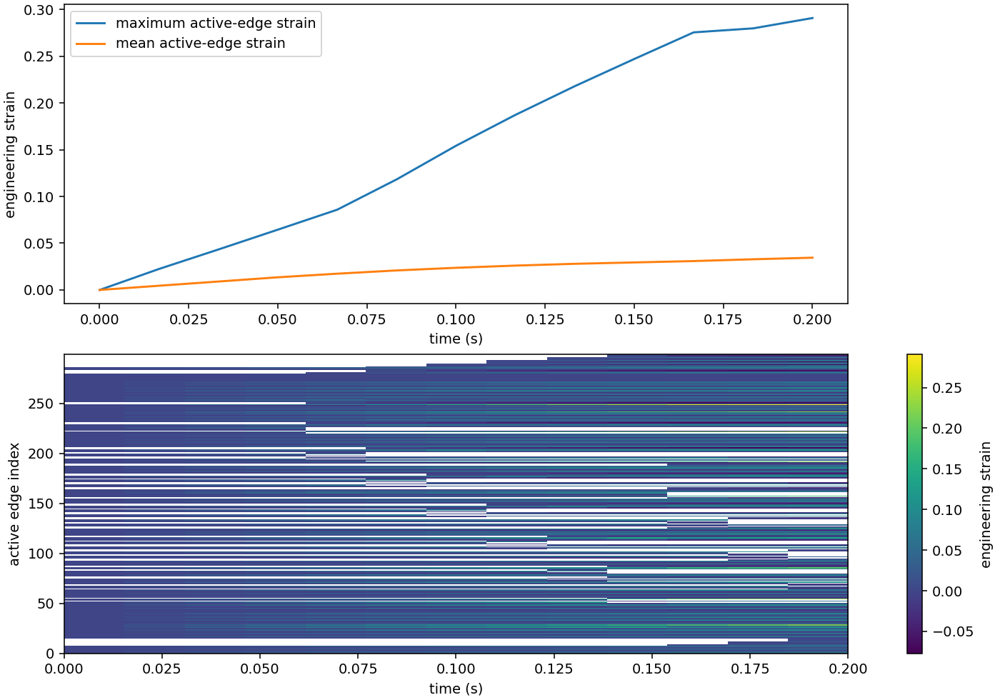
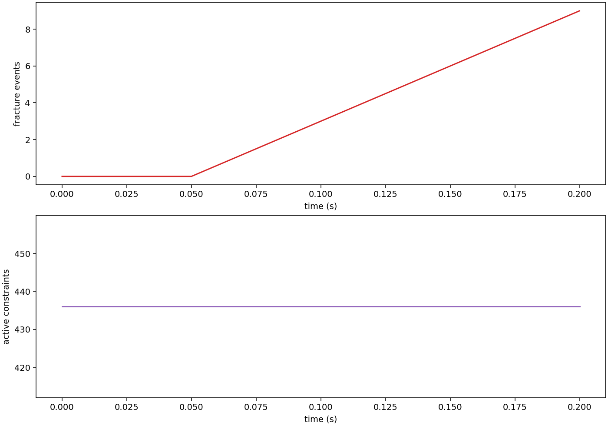
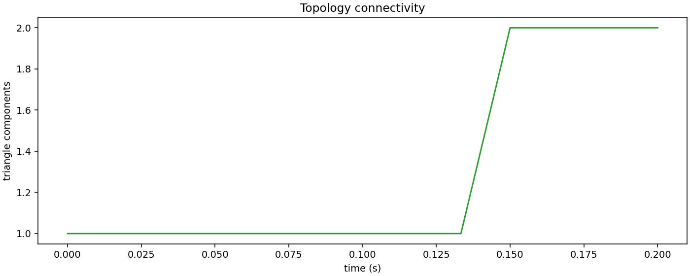
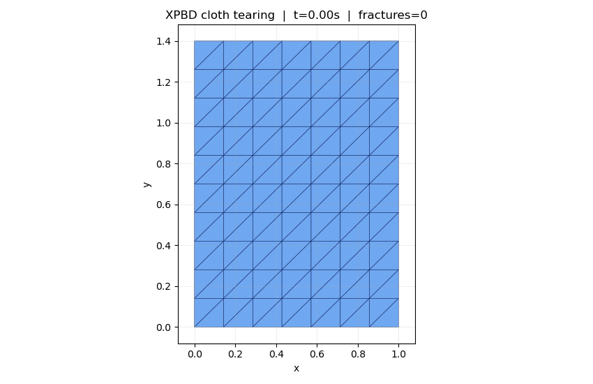

# XPBD_tear

双语项目说明 / Bilingual project guide

## 项目简介 / Project overview

本仓库是一个以 CPU 为主的 Python/Taichi XPBD 布料拉伸撕裂演示。布料一侧固定，另一侧缓慢拉伸；当内部边的工程应变超过临界值时，程序会复制顶点、重建邻接关系和约束，并形成可见裂缝。

This repository contains a CPU-first Python/Taichi demo for tensile cloth tearing with Extended Position-Based Dynamics (XPBD). One edge is pinned and the opposite edge is pulled gradually. When an interior edge exceeds the critical engineering strain, the topology and constraints are rebuilt to create a visible crack.

当前版本完成第一阶段基础能力，并作为第一、二阶段的过渡版本。XPBD 求解器与断裂策略、未来 MPM 耦合保持解耦；MPM 粒子、接触力和可微仿真暂不在当前范围内。

The Phase 1 foundation is complete and this version transitions toward Phase 2. The solver remains independent from fracture policy and future MPM coupling; MPM particles, contact forces and differentiable simulation are intentionally out of scope.

## 目录结构 / Repository layout

- project/：当前运行的 Python 实现 / active Python implementation.
- project/cloth/：粒子、网格、XPBD 约束、断裂模型和拓扑管理器 / particles, mesh, constraints, failure model and topology manager.
- project/coupling/：为未来耦合预留的 NullCoupling 空接口 / no-op coupling seam reserved for future work.
- project/viz/：无窗口诊断、曲线、GIF 和场景导出 / headless diagnostics, plots, GIF and scene export.
- project/tests/：数值验收测试 / numerical acceptance checks.
- cloth-master/：独立的 WebGPU/TypeScript 布料参考项目，不是当前 Python demo 的运行入口 / independent WebGPU/TypeScript reference project, not the active Python demo.
- artifacts/：演示产图、拓扑报告和 GIF / generated plots, topology reports and GIFs.
- environment.yml：可复现的 Conda 环境 / reproducible Conda environment.
- *.pdf：XPBD 与位置动力学参考资料 / XPBD and position-based dynamics references.

## 环境 / Environment

已验证环境为 Python 3.10、NumPy 1.26.4、Matplotlib 3.8.4 和 Taichi 1.7.4：

The verified environment uses Python 3.10, NumPy 1.26.4, Matplotlib 3.8.4 and Taichi 1.7.4:

~~~powershell
conda env create -f environment.yml
conda activate XPBD_tear
~~~

如果无法激活环境，可使用显式命令；If activation is unavailable, use:

~~~powershell
conda run -n XPBD_tear python -m project.tests.test_simulation
~~~

## 运行 / Run

交互式 Taichi demo / Interactive demo：

~~~powershell
conda run -n XPBD_tear python -m project.main
~~~

界面支持拉伸 compliance、弯曲 compliance、临界应变、子步数、撕裂开关、重置、暂停和单步控制。默认场景固定顶部并缓慢向下拉动底部。

The UI exposes stretch compliance, bend compliance, critical strain, substeps, tearing toggle, reset, pause and single-step controls. The default scenario pins the top edge and slowly pulls the bottom edge.

数值 smoke test / Numerical smoke test：

~~~powershell
conda run -n XPBD_tear python -m project.main --smoke-test --frames 120
~~~

无窗口诊断与产图 / Headless diagnostics and rendering：

~~~powershell
conda run -n XPBD_tear python -m project.main --diagnostics --render-scene --frames 80 --resolution 8 --critical-strain 0.05 --pull-speed 1.0 --output-dir artifacts
~~~

GIF 动画 / Animated GIF：

~~~powershell
conda run -n XPBD_tear python -m project.main --gif --gif-frames 60 --gif-fps 12 --resolution 8 --gif-output artifacts/xpbd_tearing_demo.gif
~~~

默认场景渲染使用稳定的 Matplotlib 3D fallback；只有确认离屏 OpenGL/EGL 可用时才启用 pyrender。

The default scene renderer is the stable Matplotlib 3D fallback. Enable pyrender only when a working offscreen OpenGL/EGL context is available:

~~~powershell
$env:XPBD_USE_PYRENDER = "1"
~~~

## Demo 产图 / Demo outputs

以下图片来自已验证的无窗口运行；红色线段表示断裂边，拓扑图和 JSON 报告记录了三角形区域断开。

The following images were generated by the verified headless run. Red segments indicate broken edges; the topology image and JSON report record disconnected triangle regions.

## 验收 / Validation

运行验收测试 / Run the acceptance test：

~~~powershell
conda run -n XPBD_tear python -m project.tests.test_simulation
~~~

测试覆盖有限数值状态、应变驱动断裂、顶点复制、三角形区域断开、约束引用重建，以及可替换的断裂模型。已验证结果为 all simulation checks passed；诊断拓扑报告为 passed: true。

The test covers finite particle states, strain-driven fracture, vertex duplication, disconnected triangle regions, regenerated constraint references and swappable failure models. The verified result is all simulation checks passed; the diagnostics report passed: true.

## 核心设计 / Key design

- ClothMaterial：材料和积分参数 / material and integration parameters.
- FailureModel：可替换的断裂判据 / swappable fracture criterion.
- TopologyManager：顶点复制和邻接重建 / vertex splitting and adjacency rebuilding.
- XPBDSolver：预测与 compliant 约束求解，不依赖断裂或 MPM 类型 / prediction and compliant constraint solving without fracture or MPM dependencies.
- NullCoupling：为下一阶段保留耦合边界，但当前不加入 MPM 代码 / explicit future coupling boundary without adding MPM code now.

## 参考 / References

- XPBD position-based simulation of compliant constrained dynamics.pdf
- Position Based DynamicsMuller2007109 - Matthias Müller, Bruno Heidelberger, Marcus Hennix, John Ratcliff.pdf
- cloth-master/：独立 WebGPU 布料实现，仅作参考 / independent WebGPU cloth implementation for reference only.
