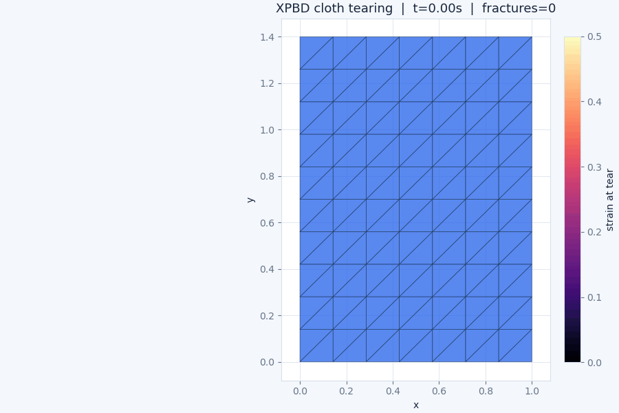
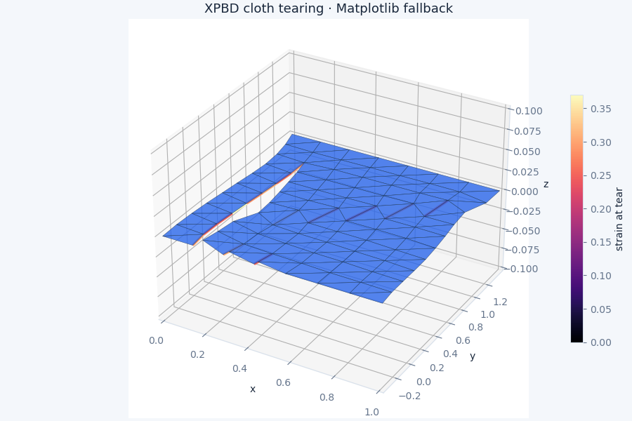

# XPBD_tear

GPT-6 Astra（Codex）与 DeepSeek Flash 协助完成本项目的实现、测试与文档。

基于 Python / Taichi 的 XPBD 布料拉伸与撕裂演示，支持 CPU、CUDA、交互窗口和无窗口产图。布料顶部固定、底部缓慢下拉，通过拉伸、弯曲与边界约束模拟形变；应变触发断边、顶点复制及拓扑重建。



## 功能

- Taichi field/kernel 求解，支持 CPU/CUDA 与 f32/f64；图着色并行投影约束。
- 可替换断裂判据、真实顶点拆分、邻接与约束重建。
- 交互调节材料 compliance、临界应变、子步数和分辨率，支持暂停、单步、重置与撕裂开关。
- 导出场景 PNG、应变曲线、断裂统计、拓扑诊断和 GIF；可选 pyrender 深度后处理。
- 支持 45,000 顶点大网格运行及 CPU/CUDA 计时。

裂缝形成后，布料可能仍是一个连通区域。诊断分别记录断边、复制顶点、分离区域和翻转三角形；有断裂时须出现几何拆分且无翻转，诊断才通过。

## 环境

从仓库根目录运行，使用命名 Conda 环境 `XPBD_tear`。已验证 Python 3.10、NumPy 1.26.4、Matplotlib 3.8.4、Taichi 1.7.4。

```powershell
conda env create -f environment.yml
conda activate XPBD_tear
```

`environment.yml` 管理完整环境：Conda 安装 Python、NumPy、Matplotlib，其中 `pip:` 补充 Taichi、Pillow、pyrender 等。`requirements.txt` 仅供已激活环境重装 pip 依赖，不能单独创建环境。无法激活时，以 `conda run -n XPBD_tear python` 替代下文的 `python`。

数值运行使用 NumPy、Taichi；诊断与 GIF 另需 Matplotlib、Pillow。CUDA 需要可工作的 NVIDIA 设备和驱动；交互窗口另需 Vulkan 和桌面图形环境。当前验证主机支持 CUDA 求解及 GGUI 窗口显示。

## 运行

```powershell
# 交互窗口；默认使用 CPU，显式指定 CUDA 使用 GPU 求解
python -m project.main --arch cuda

# 无窗口诊断、曲线和场景 PNG
python -m project.main --diagnostics --render-scene --frames 120 --resolution 8 --output-dir artifacts/demo

# GIF
python -m project.main --gif --gif-frames 120 --gif-fps 12 --resolution 8 --gif-output artifacts/demo/tearing.gif

# 无窗口稳定性检查
python -m project.main --smoke-test --frames 120
```

`--arch cpu|cuda` 选择求解后端，实际后端不符时报错。`--precision f32|f64` 选择精度，默认 f32；CPU f64 可作数值对照。不同后端与精度需分别启动进程。固定容量由 `--capacity-headroom 4.0` 控制，容量不足时增大该值重启。

默认 stretch compliance 为 `1e-6`、bend compliance 为 `2e-5`、临界工程应变为 `0.25`、下拉速度为 `0.18` 单位/秒，可用 `--critical-strain` 与 `--pull-speed` 调整加载。参数对应当前尺度与网格，不能视为通用材料常数。

Matplotlib 是默认 PNG 渲染器，无需 OpenGL。当前主机的 pyrender 已验证 Windows WGL 离屏渲染；EGL 库不可用。启用 pyrender：

```powershell
$env:XPBD_USE_PYRENDER = "1"
python -m project.main --render-scene --frames 120 --resolution 8 --post-edges --post-tonemap --output-dir artifacts/render
```

效果默认关闭，仅对 pyrender 生效；不可用时回落 Matplotlib，终端会显示实际渲染后端。

- `--post-fog` / `XPBD_POST_FOG=1`：根据深度淡化远处像素。
- `--post-ao` / `XPBD_POST_AO=1`：用邻域深度近似局部遮蔽；平面可能无可见变化。
- `--post-edges` / `XPBD_POST_EDGES=1`：强调轮廓、裂口与深度突变边界。
- `--post-tonemap` / `XPBD_POST_TONEMAP=1`：压缩亮部、调整色调。

## 大网格

```powershell
python -m project.large_demo --arch cpu
python -m project.large_demo --arch cuda
python -m project.large_demo --arch cuda --tear-probe
python -m project.large_demo_report
```

大网格为 180×250＝45,000 顶点，单点质量0.01、总质量450，下拉速度0.018单位/秒。默认计时场景保持完整布料；`--tear-probe` 单独验证首次自然断裂与约束重建。计时使用显式同步并剔除预热帧，完整帧包含 Python 断裂扫描；CUDA 在小网格上不保证更快。使用 `--scale 1 --critical-strain 0.65` 运行450顶点对照。

## 测试与结构

```powershell
python -m project.tests.test_simulation
python -m project.tests.test_simulation --arch cuda
python -m project.tests.test_simulation --precision f64
python -m project.tests.test_postprocess
```

测试覆盖有限数值状态、反复断裂、顶点复制、区域断连、约束重建、图着色和断裂判据替换。CPU f32、CPU f64、CUDA f32 均通过。

数值计时与后端比较（每次测量使用新输出目录）：

```powershell
python -m tools.measure_simulation --arch cpu --precision f32 --output-dir artifacts/measure/measure_cpu_f32
python -m tools.measure_simulation --arch cuda --precision f32 --output-dir artifacts/measure/measure_cuda_f32
python -m tools.measure_simulation --arch cpu --precision f64 --output-dir artifacts/measure/measure_cpu_f64
python -m tools.compare_backends --output-dir artifacts/measure
```

比较工具核对三份状态、误差容差与源码指纹；修改源码后需要重新测量。

```powershell
python -m tools.check_rendering --output-dir artifacts/render_check
python -m tools.check_interactive --frames 5 --output-dir artifacts/window_check
```

这两个检查分别要求真实 pyrender 离屏渲染，以及 CUDA 求解与 GGUI 桌面窗口；能力缺失时以非零状态退出。默认 Matplotlib 产图仍可独立使用。

- `project/main.py`：命令行与交互入口。
- `project/cloth/`：粒子、网格、XPBD求解、断裂与拓扑管理。
- `project/viz/`：交互显示、诊断、PNG/GIF与后处理。
- `project/coupling/`：状态交换接口及空操作实现。
- `project/tests/`：数值与后处理测试。
- `project/large_demo.py`、`project/large_demo_report.py`：大网格运行与结果汇总。
- `tools/measure_simulation.py`、`tools/compare_backends.py`：计时、状态导出及容差比较。
- `tools/check_rendering.py`、`tools/check_interactive.py`：真实离屏渲染和交互窗口检查。
- `assets/`：布料图像与动画展示。
- `artifacts/`：运行命令时按需创建，保存图像、动画、数值状态和运行结果。



## 参考文献

[1] Müller M, Heidelberger B, Hennix M, et al. Position based dynamics[J]. Journal of Visual Communication and Image Representation, 2007, 18(2): 109-118. [DOI: 10.1016/j.jvcir.2007.01.005](https://doi.org/10.1016/j.jvcir.2007.01.005).

[2] Macklin M, Müller M, Chentanez N. XPBD: Position-based simulation of compliant constrained dynamics[C]//Proceedings of the 9th International Conference on Motion in Games. New York: ACM, 2016: 49-54. [DOI: 10.1145/2994258.2994272](https://doi.org/10.1145/2994258.2994272).

[3] Macklin M, Storey K, Lu M, et al. Small steps in physics simulation[C]//Proceedings of the ACM SIGGRAPH/Eurographics Symposium on Computer Animation. New York: ACM, 2019: 1-7. [DOI: 10.1145/3309486.3340247](https://doi.org/10.1145/3309486.3340247).
